# Trove — Screen Showcase

A visual tour of the Trove web app. Screenshots are live captures of the running app
(seed/dev account with sample documents), one per screen — a shot list to narrate over
when recording the walkthrough video.

> Web app only here. The Flutter mobile client mirrors these features (camera-first
> capture, documents, spend, insights, reminders, mail, spaces, and a Developer usage
> gauge); its screens are listed at the bottom for the mobile portion of the video.

---

## Sign in

Stateless JWT auth with optional TOTP two-factor; registration is admin-approved.

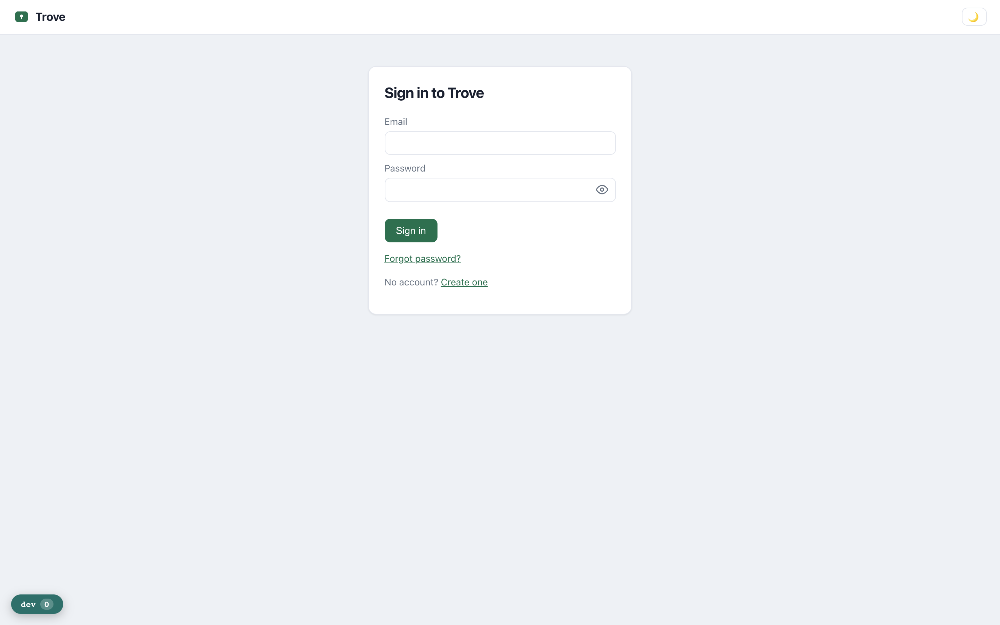

---

## Documents — the vault

The heart of the app: every filed document with category, merchant, amount, date and
review status. A `needs_review` badge marks anything the AI read but a human hasn't
confirmed yet. Category chips, a reminders banner, Trash, and pagination (10/page).

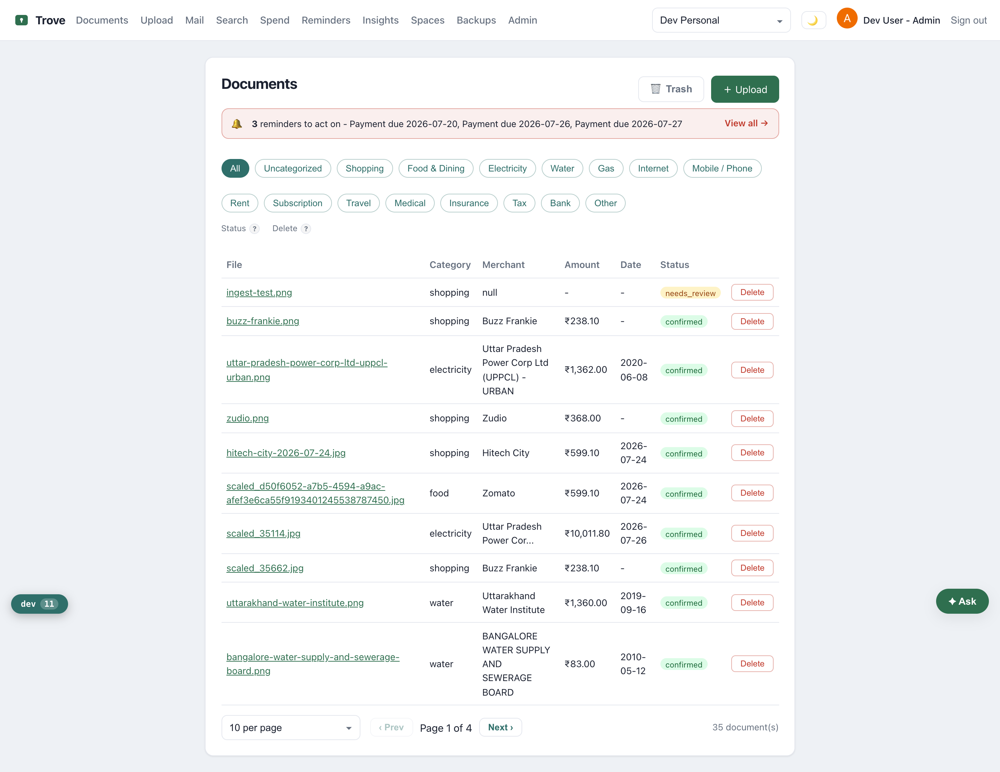

---

## Upload

Snap or pick a file; it stores to object storage with a sidecar JSON, then the vision
model reads it and it lands in review. Vital documents (IDs, policies) are encrypted at rest.

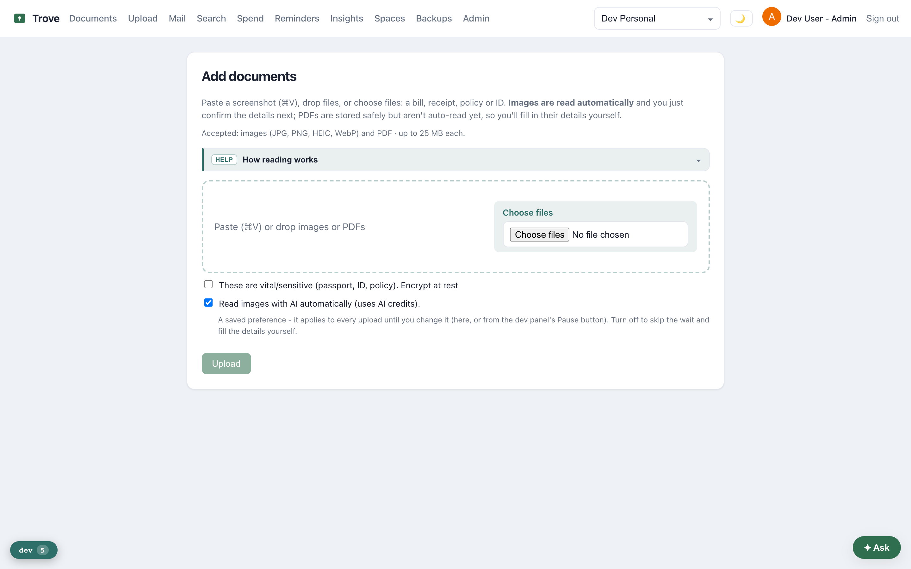

---

## Spend

Spend over confirmed documents, by category and over time. Two chart views — **Bars /
Donut** for categories and **Bars / Wave** for the trend — and the chosen view is now
**remembered across reloads and re-login**.

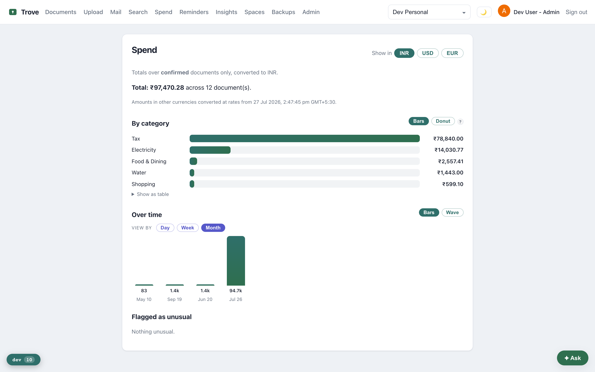

---

## Insights

Recurring/subscription detection and an "expiring soon" view (renewals, warranties),
de-duplicated against what's already handled in Reminders.

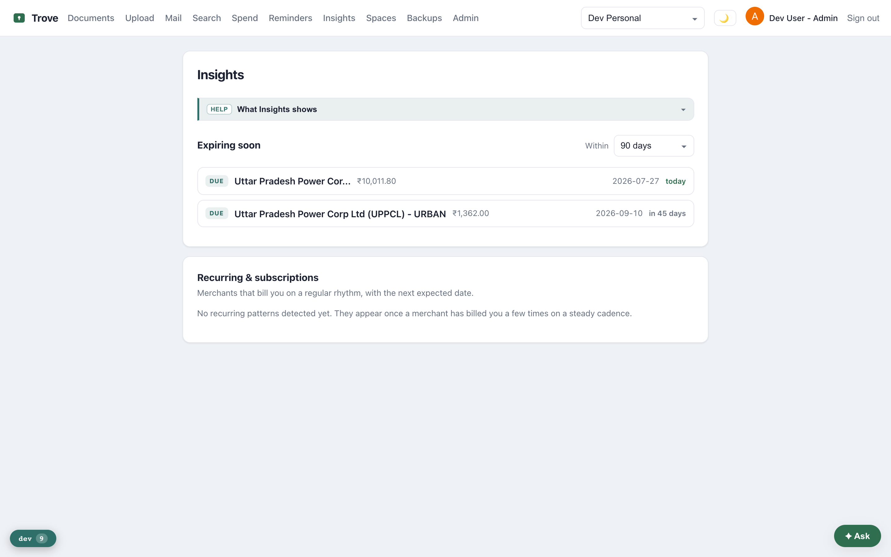

---

## Reminders

Due dates, renewals and warranties — auto-created from confirmed documents, with snooze /
done / dismiss and scheduled email + on-device delivery.

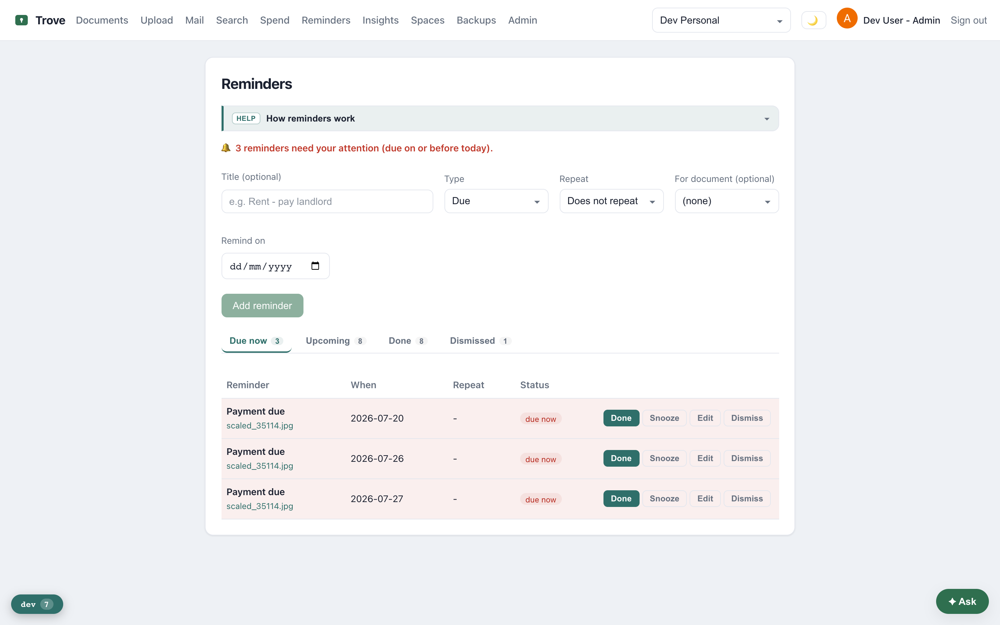

---

## Mail

Emails filed as threads (grouped by bundle), with server-side paging — the forward-to-file
inbox as a first-class surface.

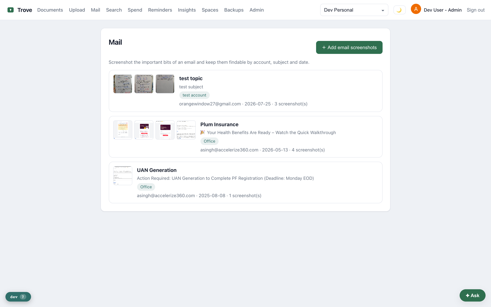

---

## Search

Natural-language search over the vault ("my last water bill", "Nike purchases"),
AI-first with a rule-based fallback when the daily budget is spent.

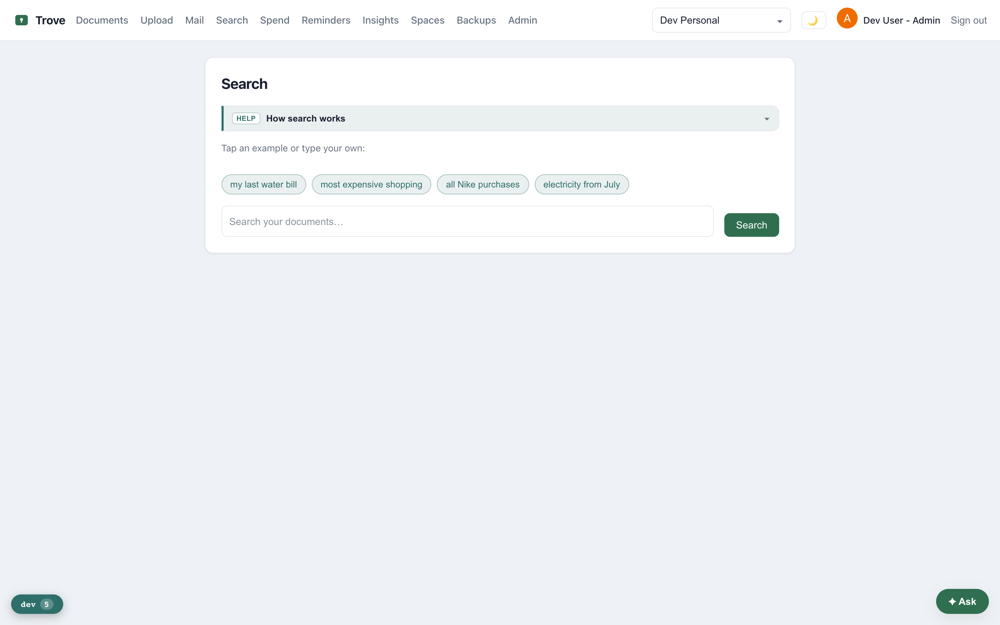

---

## Backups — three independent copies

The resilience view: tier-1 object storage, an independent second-cloud mirror, and a
human-browsable Google Drive copy, plus the on-demand full ZIP export/import.

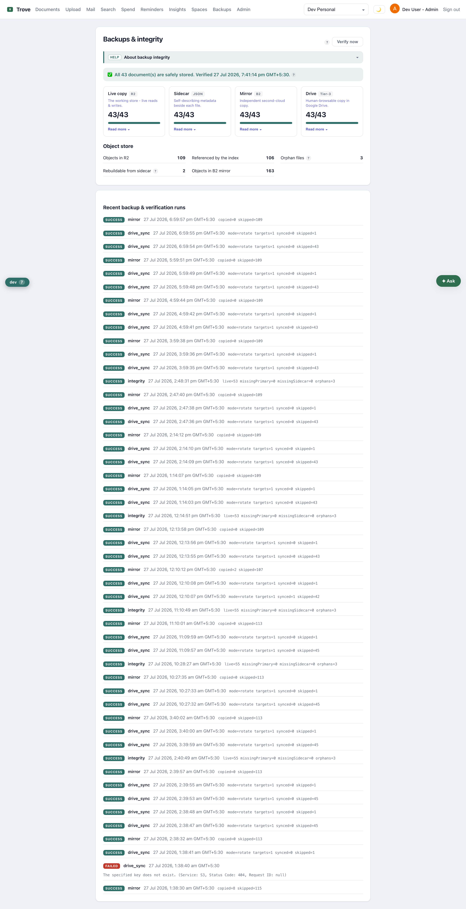

---

## Spaces

Personal + shared spaces: members and roles, invite / join link, the per-space
**forward-to-file address** (with rotate), and **Google Drive backup** (connect, active
Drive, rotate vs mirror, sync, disconnect).

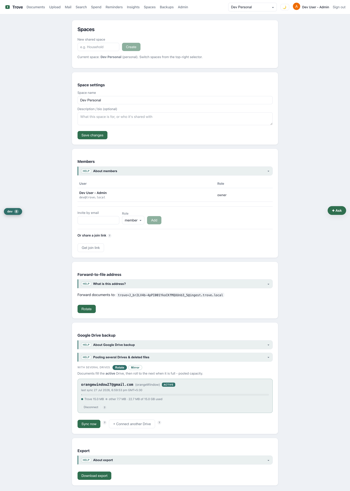

---

## Account

Profile, avatar, email change (OTP-confirmed), password change, and two-factor setup.

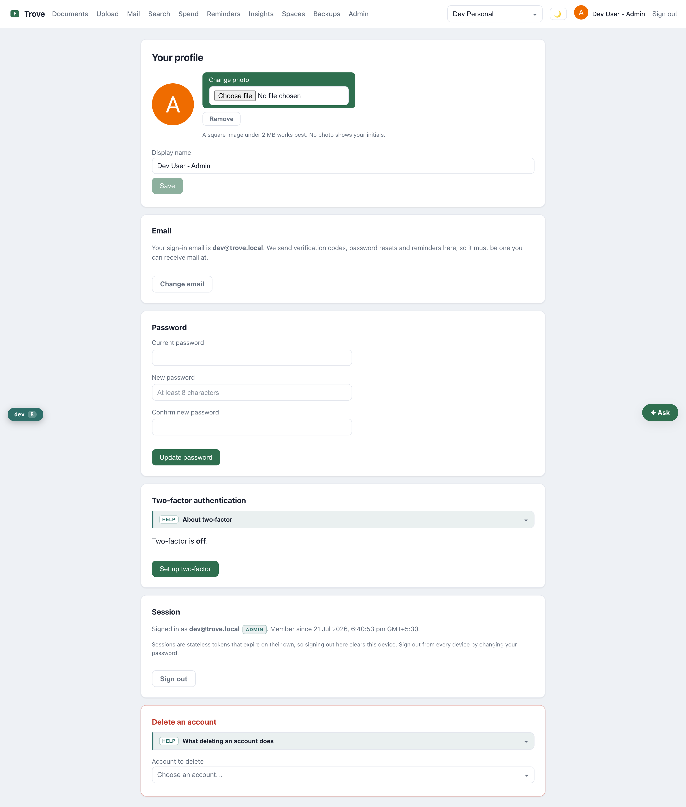

---

## Developer drawer — free-tier usage meters

The headline of the latest work: a live gauge of every free-tier limit. The two daily
pools — **AI credits** and **Email** — show the exact IST reset instant and countdown;
**Object storage**, **Database** and **Mirror** show running-total usage (collapsed under
"Other free-tier limits"). The request trail below shows `GET /api/usage` powering it.

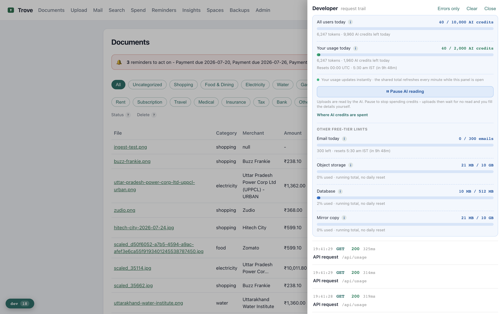

Every API call is logged in the trail — expand one to see a three-lens explanation
(user / dev / business), the server request-id, and the request **query**/**body**
(secrets masked) alongside the **response body**.

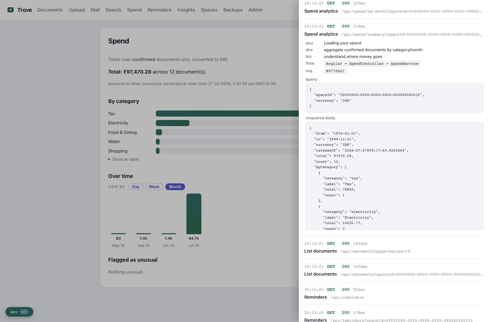

---

## Mobile (Flutter) — screens for the mobile walkthrough

Runtime screenshots need an emulator/device (not available in this capture environment).
Capture these while recording:

- **Auth** — login
- **Documents** — capture (camera + rotate/crop), list, detail, confirm (review), trash
- **Spend** — bar/donut + bar/wave, choices remembered
- **Insights**, **Reminders**, **Search**, **Mail** (list / compose / detail)
- **Spaces** — members, invite, join link, forward-to-file, **Google Drive card** (status + sync + disconnect)
- **Account**, **Admin**, **Ask your vault** (chat)
- **Developer drawer** — the same free-tier usage meters (AI, email, storage, database, mirror)
