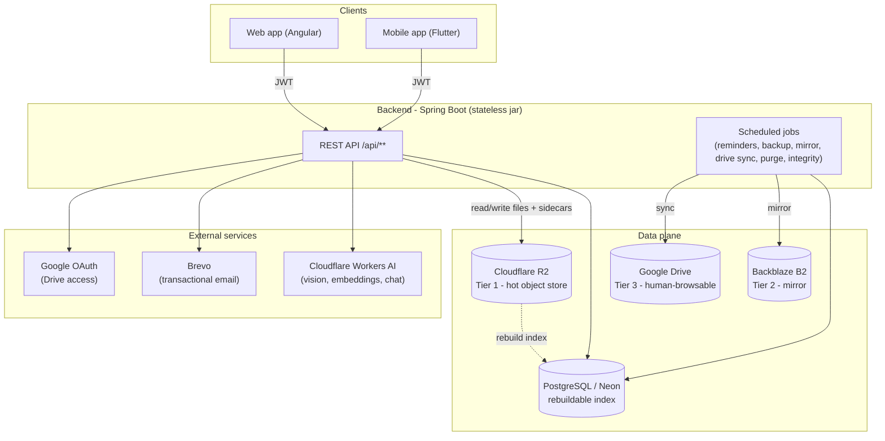
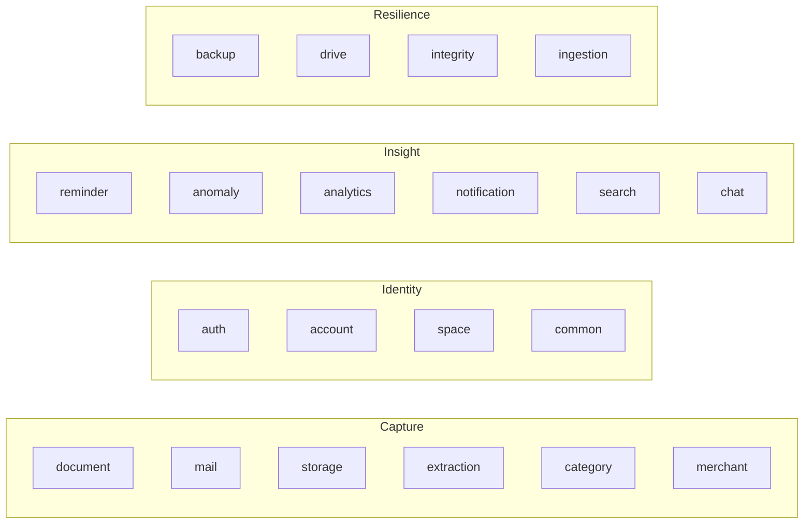
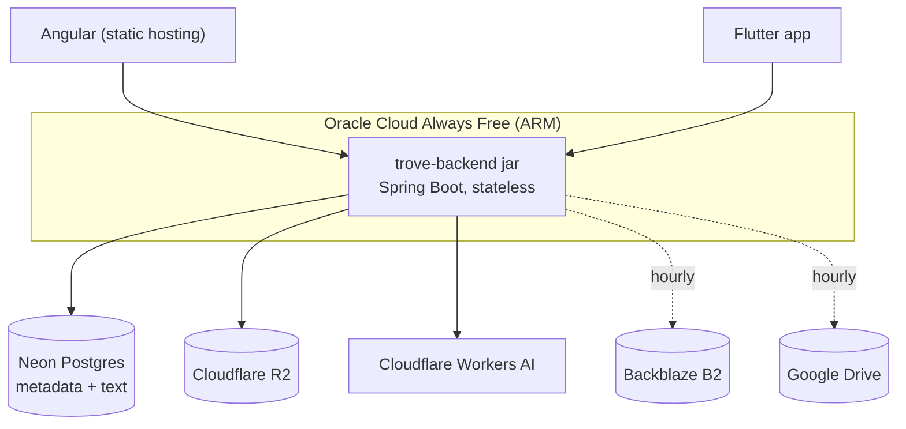
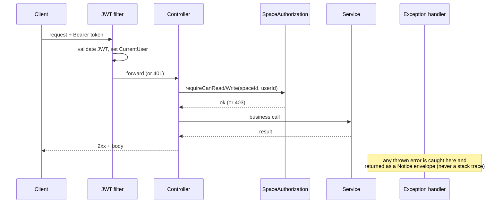
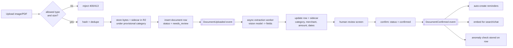

# Trove High-Level Design

This document is the map of the system: what the pieces are, how they fit, and the
principles that shape every choice. Low-level detail lives in the `lld/` documents and
the data model; the rationale for non-obvious choices lives in `DECISIONS.md`.

If any technical term here is unfamiliar (sidecar, rebuildable index, stateless JWT,
presigned URL, transactional event, embedding, and so on), it is defined from first
principles in [00-concepts.md](00-concepts.md).

## 1. Purpose

Trove is a personal and shared document vault. A user photographs or uploads a document;
Trove stores it durably, reads it with a vision model, files it by category, and extracts
the key fields (merchant, date, amount, due date). On top of that raw capture it provides
spend tracking, anomaly alerts, due-date and renewal reminders, warranty tracking, and
natural-language search and question answering over the vault.

The audience is small and trusted: on the order of 50 to 100 users, roughly 7 to 10
active at once. The whole system runs on free infrastructure tiers. That shapes the
priorities: optimise for reliability and zero data loss, not for scale to millions.

## 2. The core principle and the rules it forces

> The app is disposable. The data is not. Losing the entire app, database, and host must
> lose zero documents.

Three non-negotiable design rules follow directly:

1. **The uploaded image or PDF is the only source of truth.** Files live in object
   storage. The database is a rebuildable index, never the source of truth. If the
   database is wiped, it can be rebuilt by scanning the bucket.
2. **Every stored file has a sidecar JSON next to it** holding its metadata, so the
   object store is self-describing:
   ```
   electricity/2026-01/reliance-jan.jpg
   electricity/2026-01/reliance-jan.json   -> {category, merchant, date, amount, dueDate, rawText, owner, ...}
   ```
3. **Three independent copies exist, one human-browsable without the app:**
   - Tier 1 (hot): Cloudflare R2, live reads and writes.
   - Tier 2 (independent cloud mirror): a scheduled copy to Backblaze B2.
   - Tier 3 (human-navigable): Google Drive, synced on a schedule and organised as
     `Trove / {space} / {category} / {YYYY-MM} / file`, so if everything else is down a
     user opens Drive and finds the document with no app involved.

An on-demand full export (a single ZIP with a complete `manifest.json`, a spreadsheet
`data.csv`, and a `files/` folder of originals) is the ultimate guarantee: uploading that
ZIP back fully restores the system.

These rules are why storage, sidecars, and backup are first-class modules rather than
afterthoughts, and why the database schema is treated as derived data.

## 3. System context



Actors: a **user** (owns a personal space, may join shared spaces) and an **admin**
(a single configured account that approves new sign-ups). Documents can also arrive
without a client at all, by forwarding email to a per-space ingest address.

## 4. Technology stack

| Layer | Choice | Notes |
| --- | --- | --- |
| Backend | Spring Boot, Java 21 | Package-by-feature. Compiles to Java 21 bytecode; the dev machine runs JDK 25 (D2). No Lombok; explicit code with structured headers (D7). |
| Web | Angular | Standalone components, signal-based state, lazy-loaded routes. |
| Mobile | Flutter | Single codebase, camera-first capture, on-device reminder notifications. |
| Database | PostgreSQL (Neon free tier in production) | Metadata and extracted text only, kilobytes per document. Flyway owns the schema; Hibernate is `ddl-auto: validate`. pgvector for embeddings. |
| Object storage | Cloudflare R2 (S3-compatible) | Accessed through the AWS S3 SDK with the endpoint overridden, so the same code targets MinIO locally and R2 in production (D1). |
| Mirror | Backblaze B2 (S3-compatible) | Independent second provider; append-only key-diff copy (D19). |
| Human-browsable copy | Google Drive | Per-space-owner OAuth, `drive.file` scope (D17). |
| AI | Cloudflare Workers AI | Vision extraction, text embeddings, and chat, under a shared free daily quota (D22). |
| Email | Brevo | Password-reset and reminder email. |
| Host | Oracle Cloud Always Free ARM | Runs the stateless jar. If reclaimed, redeploy; no data lives on the host. |
| Local dev | docker-compose | Postgres + MinIO, so the whole app builds and runs with no cloud account. |

## 5. Module map (package-by-feature)

The backend is organised by feature, not by layer. Every module owns its controller,
service, repository, and domain types. Cross-module contact is through interfaces
(`StorageService`, `ExtractionProvider`, `EmbeddingProvider`) and Spring events, so
providers are swappable and features stay decoupled.



| Module | Responsibility |
| --- | --- |
| `document` | The heart: upload, list, get, confirm, soft delete, restore, purge, export and import. Owns the document lifecycle and the sidecar writes. |
| `mail` | Email documents (category `email`) grouped into threads by a shared bundle id; server-side thread paging and add-form facets, reusing the document mapping. |
| `storage` | The `StorageService` seam over S3-compatible object storage; sidecar read and write; presigned URLs. |
| `extraction` | The `ExtractionProvider` chain (Cloudflare vision first, stub fallback), the async extraction worker, and the AI usage tracker and daily budget. |
| `category` / `merchant` | Category taxonomy (global plus per-space) and merchant canonicalisation with aliases. |
| `auth` | Registration, login, stateless JWT, TOTP two-factor, password reset, and admin approval of new sign-ups. |
| `account` | User profile: display name, profile photo (stored in R2, served via presigned URL), email change confirmed by an OTP to the new address, password change, and an admin-only account deletion. |
| `space` | Personal and shared spaces, membership and roles, invitations, join links, and per-space ingest addresses. |
| `common` | Cross-cutting concerns: the JWT filter and `CurrentUser`, the global exception handler and the Notice envelope, the AES-GCM encryption service, and shared errors. |
| `reminder` | Due, renewal and warranty reminders; recurrence; snooze, done, edit, dismiss; auto-creation from confirmed documents; subscription detection; scheduled dispatch. |
| `anomaly` | Flags a confirmed bill that is higher than usual for its category, at confirm time. |
| `analytics` | Spend aggregation by category and by month, over confirmed documents. |
| `notification` | Delivery of reminder notifications (email via the notifier; on-device on mobile). |
| `search` | Natural-language search over the vault, AI-first with a rule-based fallback. |
| `chat` | Retrieval-augmented "Ask your vault": embeddings in pgvector, grounded answers with citations, and cost-aware model routing. |
| `backup` | The pg_dump job, the second-cloud mirror job, and the export or import of the full ZIP. |
| `drive` | Google Drive integration: OAuth, folder tree, pooled multi-Drive sync (rotate or mirror), and quota tracking. |
| `integrity` | Verifies the three tiers agree and reports what is rebuildable, on a schedule and on demand. |
| `ingestion` | Forward-to-file: email and WhatsApp webhooks that route an attachment to a space and run it through the upload pipeline. |

## 6. Runtime and deployment topology



The backend is a single stateless jar. It holds no durable state on disk, so the host is
disposable: if Oracle reclaims the instance, redeploy the jar and point it at the same
Neon, R2, B2 and Drive, and the system is whole. Secrets come from environment variables
only. Configuration is documented in `operations/configuration.md`.

Scheduled work runs inside the same jar on fixed delays (there is no separate scheduler
service, by design at this scale): reminder dispatch, the pg_dump backup, the B2 mirror,
the Drive sync, the 30-day trash purge, the embedding sweep, and the backup-integrity
check.

## 7. The request lifecycle

Every authenticated request follows the same path, so the security and feedback
behaviour is uniform:



- **Authentication** is stateless JWT (D10). The filter reads the bearer token, validates
  it, and exposes the caller through `CurrentUser`. Only a small allow-list is public:
  `/api/auth/**`, `/api/health`, the ingest webhooks, and the Drive OAuth callback.
- **Authorization** is per-space membership, checked in the service through
  `SpaceAuthorization` against the caller's role (owner, member, viewer). A document
  always belongs to exactly one space; access is decided by space membership, never by
  document ownership alone.
- **Feedback** is uniform through the Notice System (D23): every response, success or
  failure, can carry a two-channel notice (a calm user message plus a developer note and
  a code), so the client never shows a raw error and a developer can always see what
  happened. Errors are turned into notices by a single global exception handler.

## 8. The load-bearing cross-cutting flows

### 8.1 Upload to confirmed (the core path)



Extraction is asynchronous and always lands in `needs_review`; a human confirms the
fields before a document is trusted. The AI will misread amounts and dates, so extracted
numbers are never trusted silently. See `architecture/05-ai-and-extraction.md` and
`lld/documents.md`.

### 8.2 Backup fan-out (scheduled)

R2 is written synchronously on upload. Two independent jobs then propagate copies on an
hourly cadence: the B2 mirror copies any object key not yet present in B2, and the Drive
sync copies confirmed documents into the human-readable folder tree. Both are best-effort
and idempotent, so a failed run simply retries next time. See
`architecture/04-resilience-and-backup.md`.

### 8.3 Disaster recovery (database lost)

Because every file has a sidecar, the database is rebuildable. The rebuild job scans the
R2 bucket, reads each sidecar, and reinserts the corresponding index rows. Nothing in the
database is authoritative that is not also in a sidecar. The full ZIP export and import is
the manual equivalent and can also restore onto a fresh, empty system.

## 9. Non-functional requirements

| Concern | Target and approach |
| --- | --- |
| Durability | Zero document loss. Three independent copies, self-describing sidecars, rebuildable index, and a lossless export. This is the top priority and overrides convenience. |
| Reliability | An upload never fails because the AI failed: extraction degrades to a stub and the document is still stored for manual entry (D9). Jobs are idempotent and best-effort. |
| Cost | Everything stays within free tiers. AI spend is bounded by a shared daily budget with per-user caps and cost-aware model routing (D22). Pricing is checked before any AI feature is added. |
| Scale | Roughly 100 users, about 10 concurrent. No Kafka, no microservices. Scheduled jobs run in-process. The design deliberately avoids scale complexity it does not need. |
| Security | Stateless JWT, BCrypt passwords, optional TOTP two-factor, admin-approved sign-up, per-space authorization, and AES-256-GCM encryption at rest for vital documents (D18, D21). Secrets via environment only. |
| Privacy | Vital documents (passport, ID, policies) are sensitive PII and are encrypted at rest, decided at the storage layer, and served through a decrypt-stream path rather than a public URL. |
| Observability | The Notice System surfaces developer notes to the client; a health endpoint and a backup-runs view expose job outcomes; the integrity report shows tier agreement. |
| Maintainability | Package-by-feature, provider interfaces, Flyway-owned schema, explicit code with file and method headers, and a living decision log. |

## 10. What Trove deliberately does not do

- No microservices, no message broker, no separate scheduler. In-process jobs are correct
  at this scale.
- No blobs in the database. Images and PDFs live only in object storage.
- No skipping the human review step to look smarter. Extracted numbers are always
  confirmed by a person first.
- No paid infrastructure. If a feature cannot fit a free tier, it is redesigned or
  deferred, not bought.
