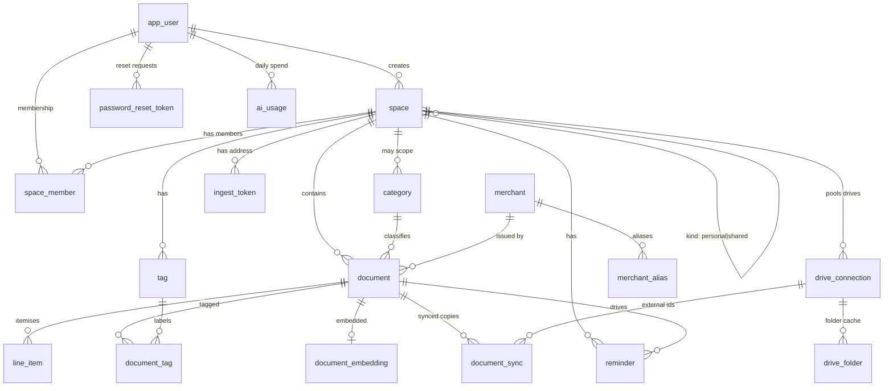

# Trove Data Model

This is the complete relational model: every table, its columns, and its relationships.
Column names and types are the real database identifiers, taken from the live schema.

Remember the core principle: **the database is a rebuildable index, not the source of
truth.** Everything here can be reconstructed by scanning the object store and reading
each file's sidecar JSON. The database exists to make the vault fast to query, search and
aggregate; it holds metadata and extracted text only (kilobytes per document), never the
images or PDFs themselves.

Flyway owns the schema (migrations `V1` to `V23`); Hibernate runs with
`ddl-auto: validate`, so the code never mutates the schema, only verifies it matches.

## Entity-relationship overview

Conventions across the schema:

- Primary keys are `uuid` defaulting to `gen_random_uuid()`, except join tables and
  natural-key tables noted below.
- Timestamps are `timestamptz` defaulting to `now()`.
- Money is `numeric`; a document also carries a `currency` (default `INR`).
- `text` is used for all strings; status and type columns are free text validated in the
  application, so adding a new value (for example a new reminder status) needs no schema
  change.
- Foreign keys to `space` and `document` cascade on delete where a child cannot outlive
  its parent (line items, tags, embeddings, sync rows, reminders).

## Identity and access

### app_user

The account. Passwords are BCrypt hashes; the TOTP secret, when set, is encrypted at rest.

| Column | Type | Null | Default | Notes |
| --- | --- | --- | --- | --- |
| id | uuid | no | gen_random_uuid() | PK |
| email | text | no | | unique login |
| display_name | text | no | | |
| password_hash | text | no | | BCrypt |
| created_at | timestamptz | no | now() | |
| totp_secret_enc | text | yes | | AES-GCM encrypted TOTP secret; null until 2FA is set up |
| totp_enabled | boolean | no | false | whether two-factor is active |
| status | text | no | 'active' | `active`, `pending` (awaiting admin approval), `rejected` |

### space

A container of documents. Every user has one `personal` space; `shared` spaces are
created to collaborate.

| Column | Type | Null | Default | Notes |
| --- | --- | --- | --- | --- |
| id | uuid | no | gen_random_uuid() | PK |
| name | text | no | | |
| kind | text | no | 'personal' | `personal` or `shared` |
| created_by | uuid | no | | FK app_user |
| created_at | timestamptz | no | now() | |
| description | text | yes | | optional bio (V14) |
| drive_sync_mode | text | no | 'rotate' | `rotate` (fill active Drive, then roll) or `mirror` (copy to all) (V17) |
| join_token | text | yes | | unguessable token behind a request-to-join link (V22) |

### space_member

Membership and role. Composite key of `(space_id, user_id)`.

| Column | Type | Null | Default | Notes |
| --- | --- | --- | --- | --- |
| space_id | uuid | no | | FK space |
| user_id | uuid | no | | FK app_user |
| role | text | no | 'member' | `owner`, `member`, `viewer` |
| joined_at | timestamptz | no | now() | |
| status | varchar | no | 'active' | `active`, `pending` (invited or requested), `declined` (V13) |
| invited_by | uuid | yes | | who invited; null means the user self-requested via a join link |

### password_reset_token

Single-use, hashed, expiring reset tokens (V20).

| Column | Type | Null | Default | Notes |
| --- | --- | --- | --- | --- |
| id | uuid | no | gen_random_uuid() | PK |
| user_id | uuid | no | | FK app_user |
| token_hash | text | no | | SHA-256 of the emailed token; the raw token is never stored |
| expires_at | timestamptz | no | | 30-minute window |
| used_at | timestamptz | yes | | set when redeemed; single use |
| created_at | timestamptz | no | now() | |

### ingest_token

The per-space forward-to-file address secret (V8). Natural key on `space_id`.

| Column | Type | Null | Default | Notes |
| --- | --- | --- | --- | --- |
| space_id | uuid | no | | FK space |
| token | text | no | | unguessable; routes an inbound email to this space |
| created_at | timestamptz | no | now() | |

## Documents and their metadata

### document

The central index row. One row per stored file. The image or PDF and its sidecar live in
object storage; this row is the queryable projection of that sidecar.

| Column | Type | Null | Default | Notes |
| --- | --- | --- | --- | --- |
| id | uuid | no | gen_random_uuid() | PK |
| space_id | uuid | no | | FK space |
| uploaded_by | uuid | no | | FK app_user |
| storage_key | text | no | | object key of the file in R2 |
| sidecar_key | text | no | | object key of the sidecar JSON |
| file_hash | text | no | | SHA-256 of the plaintext bytes; dedupe within a space |
| mime_type | text | no | | |
| size_bytes | bigint | no | | plaintext size |
| original_filename | text | yes | | |
| category_id | uuid | yes | | FK category; null until classified |
| merchant_id | uuid | yes | | FK merchant |
| doc_date | date | yes | | the date printed on the document |
| amount | numeric | yes | | total on the document |
| currency | text | yes | 'INR' | |
| due_date | date | yes | | payment or renewal date, if any |
| raw_text | text | yes | | OCR text read by the model |
| extra | jsonb | no | '{}' | extension bag: extraction trail, anomaly verdict, mail fields, notes, warrantyUntil |
| extraction_confidence | numeric | yes | | null is the "extraction pending" sentinel (D5) |
| is_vital | boolean | no | false | sensitive PII; drives encryption at rest |
| status | text | no | 'needs_review' | `needs_review`, `confirmed`, `deleted` |
| reviewed_by | uuid | yes | | FK app_user; set at confirm |
| reviewed_at | timestamptz | yes | | |
| created_at | timestamptz | no | now() | upload time |
| updated_at | timestamptz | no | now() | |
| encrypted | boolean | no | false | whether the stored bytes are AES-GCM encrypted (V9) |
| deleted_at | timestamptz | yes | | soft-delete timestamp (V18) |
| deleted_by | uuid | yes | | FK app_user |
| trash_key | text | yes | | object key under the `_trash/` prefix while in Trash |

The `extra` jsonb is deliberately open so features can attach data without a migration.
Known keys include `anomaly` (the verdict map), `warrantyUntil` (drives warranty
reminders), `notes`, the mail fields (`mailSubject`, `mailTopic`, `mailAccount`, ...), and
the extraction trail (`extractionMeta`, `extractionProvider`, `extractionModel`).

### line_item

Optional itemisation of a document (a receipt's lines). Cascades with the document.

| Column | Type | Null | Default | Notes |
| --- | --- | --- | --- | --- |
| id | uuid | no | gen_random_uuid() | PK |
| document_id | uuid | no | | FK document |
| description | text | yes | | |
| quantity | numeric | yes | | |
| unit_price | numeric | yes | | |
| amount | numeric | yes | | |

### category

The classification taxonomy. A `space_id` of null means a global category available to
everyone; a non-null `space_id` is a space-specific category.

| Column | Type | Null | Default | Notes |
| --- | --- | --- | --- | --- |
| id | uuid | no | gen_random_uuid() | PK |
| space_id | uuid | yes | | FK space; null = global |
| code | text | no | | stable code, e.g. `electricity`, `insurance`, `email` |
| label | text | no | | display label |

Seeded global codes include uncategorized, shopping, electricity, water, gas, internet,
mobile, insurance, medical, travel, food, rent, subscription, tax, bank, email, other.

### merchant and merchant_alias

Canonical merchant names, with aliases so variant spellings collapse to one merchant.

| merchant | Type | Null | Default | Notes |
| --- | --- | --- | --- | --- |
| id | uuid | no | gen_random_uuid() | PK |
| canonical_name | text | no | | unique |
| created_at | timestamptz | no | now() | |

| merchant_alias | Type | Null | Default | Notes |
| --- | --- | --- | --- | --- |
| id | uuid | no | gen_random_uuid() | PK |
| merchant_id | uuid | no | | FK merchant |
| alias | text | no | | a spelling that maps to the canonical merchant |

### tag and document_tag

Tax-style labels ("80C", "medical") on documents. `document_tag` is the join table.

| tag | Type | Null | Default | Notes |
| --- | --- | --- | --- | --- |
| id | uuid | no | gen_random_uuid() | PK |
| space_id | uuid | no | | FK space |
| name | text | no | | unique within a space |

| document_tag | Type | Null | Default | Notes |
| --- | --- | --- | --- | --- |
| document_id | uuid | no | | FK document |
| tag_id | uuid | no | | FK tag |

### document_embedding

The semantic index for search and "Ask your vault" (V19). One vector per document, keyed
one-to-one on `document_id`. Uses the pgvector extension.

| Column | Type | Null | Default | Notes |
| --- | --- | --- | --- | --- |
| document_id | uuid | no | | PK, FK document |
| space_id | uuid | no | | FK space; retrieval is space-scoped |
| embedding | vector(768) | no | | pgvector; cosine distance via the `<=>` operator |
| model | text | no | | the embedding model that produced it; a model change re-embeds |
| updated_at | timestamptz | no | now() | |

## Reminders

### reminder

A scheduled nudge, optionally tied to a document (V4, extended in V23).

| Column | Type | Null | Default | Notes |
| --- | --- | --- | --- | --- |
| id | uuid | no | gen_random_uuid() | PK |
| document_id | uuid | yes | | FK document; null for a standalone reminder |
| space_id | uuid | no | | FK space |
| type | text | no | | `due`, `renewal`, `warranty_expiry` |
| title | text | yes | | optional human label, e.g. "Rent - pay landlord" (V23) |
| remind_on | date | no | | the date it fires |
| recurrence | text | no | 'none' | `none`, `weekly`, `monthly`, `quarterly`, `yearly` (V23) |
| status | text | no | 'pending' | `pending`, `sent`, `dismissed`, `done` (V23) |
| completed_at | timestamptz | yes | | when marked done (V23) |
| created_at | timestamptz | no | now() | |

A partial index on `remind_on` where `status = 'pending'` keeps the dispatch scan cheap.

## Resilience: backup, Drive and mirror

### backup_run

An observability log of backup and DR jobs (V5), shown in the admin backup-runs view.

| Column | Type | Null | Default | Notes |
| --- | --- | --- | --- | --- |
| id | uuid | no | gen_random_uuid() | PK |
| kind | text | no | | `pg_dump`, `mirror`, `drive`, `rebuild`, ... |
| status | text | no | | `ok`, `failed`, running |
| location | text | yes | | where the artifact landed |
| started_at | timestamptz | no | now() | |
| finished_at | timestamptz | yes | | |
| detail | text | yes | | counts, errors, notes |

### drive_connection

One linked Google Drive (V7, extended V15 to V17). A space may pool several, so this is
many-per-space.

| Column | Type | Null | Default | Notes |
| --- | --- | --- | --- | --- |
| id | uuid | no | gen_random_uuid() | PK |
| space_id | uuid | no | | FK space |
| refresh_token_enc | text | no | | AES-GCM encrypted OAuth refresh token |
| root_folder_id | text | yes | | the Trove root folder in this Drive |
| connected_by | uuid | yes | | FK app_user |
| connected_at | timestamptz | no | now() | |
| last_sync_at | timestamptz | yes | | |
| google_email | text | yes | | account identity (V15) |
| google_account_name | text | yes | | |
| storage_limit_bytes | bigint | yes | | quota from about.get (V16) |
| storage_usage_bytes | bigint | yes | | |
| quota_checked_at | timestamptz | yes | | |
| is_active | boolean | no | true | the Drive new files sync to in rotate mode (V17) |
| status | text | no | 'active' | `active` or `full` |

### drive_folder

A per-connection cache of created folder ids, so the sync does not recreate the tree
each run. Keyed per connection because each Drive has its own tree (V17).

| Column | Type | Null | Default | Notes |
| --- | --- | --- | --- | --- |
| id | uuid | no | gen_random_uuid() | PK |
| space_id | uuid | no | | FK space |
| path | text | no | | logical path, e.g. `Trove/Household/electricity/2026-01` |
| folder_id | text | no | | the Drive folder id for that path |
| connection_id | uuid | no | | FK drive_connection |

### document_sync

Records that a document has a copy at a target, with the target's external id, so syncs
are idempotent and copies are traceable. Keyed per connection (V17).

| Column | Type | Null | Default | Notes |
| --- | --- | --- | --- | --- |
| document_id | uuid | no | | FK document |
| target | text | no | | `drive`, `b2`, ... |
| external_id | text | no | | the id or key at the target |
| synced_at | timestamptz | no | now() | |
| connection_id | uuid | no | | FK drive_connection (for Drive targets) |

## AI cost accounting

### ai_usage

Per-user, per-day AI spend, used to enforce the shared daily budget and per-user caps
(V11). Composite key `(day, user_id)`.

| Column | Type | Null | Default | Notes |
| --- | --- | --- | --- | --- |
| day | date | no | | the usage day |
| user_id | uuid | no | | FK app_user |
| neurons | double precision | no | 0 | Cloudflare Workers AI cost unit |
| tokens | bigint | no | 0 | tokens consumed |

## Migration history

Flyway migrations, in order. Each is additive and back-compatible; the schema is never
edited in place by the application.

| Version | Adds |
| --- | --- |
| V1 | identity and spaces: `app_user`, `space`, `space_member` |
| V2 | `category`, `merchant`, `merchant_alias` |
| V3 | `document`, `line_item` |
| V4 | `reminder`, `tag`, `document_tag` |
| V5 | `backup_run` (backup observability) |
| V6 | seed dev user, personal space, and global categories |
| V7 | Google Drive integration: `drive_connection`, `drive_folder`, `document_sync` |
| V8 | `ingest_token` (per-space forward-to-file address) |
| V9 | `document.encrypted` |
| V10 | `email` category |
| V11 | `ai_usage` |
| V12 | `bank` category |
| V13 | `space_member.status` and `invited_by` (membership lifecycle) |
| V14 | `space.description` |
| V15 | `drive_connection` account identity (google_email, google_account_name) |
| V16 | `drive_connection` storage quota columns |
| V17 | Drive pooling: many-per-space, per-connection folder and sync keys, `drive_sync_mode`, `is_active` |
| V18 | `document` soft delete: `deleted_at`, `deleted_by`, `trash_key` |
| V19 | `document_embedding` (pgvector) |
| V20 | `password_reset_token` and `app_user` TOTP columns |
| V21 | `app_user.status` (admin approval) |
| V22 | `space.join_token` |
| V23 | reminder lifecycle: `title`, `recurrence`, `completed_at` (and the `done` status) |
