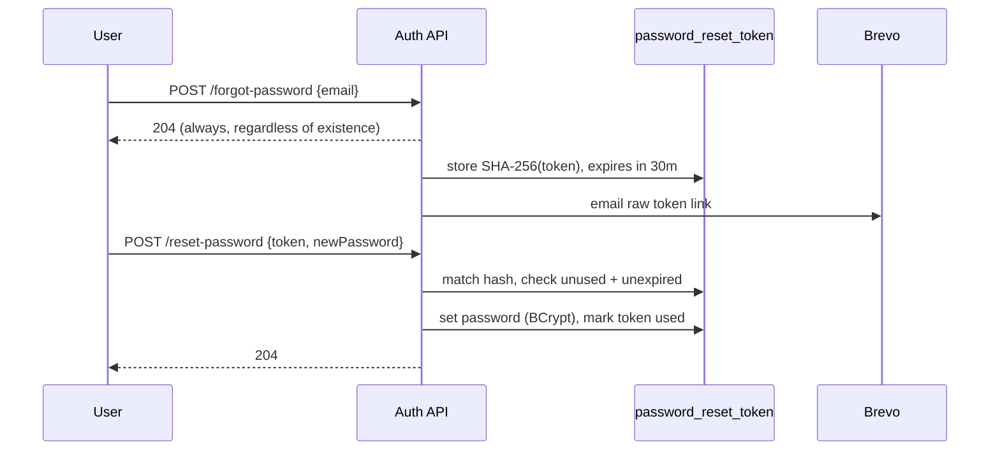

# Security and Access Control

This document covers how Trove decides who you are (authentication), what you may do
(authorization), and how sensitive data is protected (encryption and secrets). Concepts
such as stateless JWT, BCrypt, TOTP, OAuth refresh tokens and AES-256-GCM are defined
from first principles in [00-concepts.md](00-concepts.md); this document is about how
Trove applies them. The originating decisions are D10 (auth model), D18 (encryption seam),
D21 (vital documents) and D22 (AI hardening).

## 1. The access model in one paragraph

Every user authenticates with email and password, optionally reinforced by a time-based
one-time code (TOTP). A successful login yields a stateless JWT that the client sends on
every request. Authorization is not global: a user's rights are decided per space by their
membership role (owner, member or viewer). A document always belongs to exactly one space,
so "can this user see this document" reduces to "is this user a member of that document's
space, and with what role". A single configured admin account approves new sign-ups.
Sensitive documents and all stored secrets are encrypted at rest.

## 2. Authentication

### 2.1 Registration, email verification, and the approval gate

Sign-up has two gates in order. First, **email verification**: a new account is created with
status `unverified` and no token, and a six-digit code is emailed to the address. The user
must enter that code (`verify-email`) to prove the email is real and reachable, since Trove
relies on it for password resets and reminder nudges. The code is stored only as a SHA-256
hash with a 15-minute expiry and at most five attempts (one active code per user, resendable);
this is the same hash-and-expire design as password reset. Verification is required, not
skippable, so an account can never exist with an address that cannot receive mail.

Only once the email is verified does the second gate apply: **admin approval**. Because the
audience is small and trusted, the now-verified account becomes `pending` and cannot sign in
until the admin approves it (status then `active`); the admin is emailed the access request at
this point, not before. The admin's own account, or an explicitly open registration mode, goes
straight to `active` with a token. This keeps the vault invite-only, with only real addresses,
without building a full invitation-email system. See section 5 for the admin mechanism.

The account status therefore progresses `unverified` -> `pending` -> `active` (or `rejected`).
Existing accounts predate the email step and remain `active`/`pending`, unaffected.

### 2.2 Login and the JWT

Login verifies the password against its BCrypt hash and, on success, issues a JSON Web
Token signed with an HMAC-SHA256 secret (`trove.security.jwt.secret`). The token's lifetime
is configurable and defaults to 720 minutes (12 hours,
`trove.security.jwt.expiration-minutes`). The token carries the user id, email and display
name as claims.

The client stores the token and sends it as `Authorization: Bearer <token>` on every
request. A servlet filter validates the signature and expiry on each call and exposes the
authenticated caller through a `CurrentUser` component that services read. Because the
server keeps no session, any instance can serve any request, which suits a single stateless
jar that may be redeployed at any time. The trade-off is revocation: a token is valid until
it expires, so the lifetime is kept modest and rotating the signing secret invalidates all
outstanding tokens at once.

Only a small allow-list of routes is public; everything else requires a valid token:

- `/api/auth/**` (register, login, forgot-password, reset-password)
- `/api/health`
- `/api/ingest/**` (the forward-to-file webhooks, guarded by their own shared secret and
  per-space token)
- the Google Drive OAuth callback

### 2.3 Two-factor authentication (TOTP)

A user may protect sign-in with a standard authenticator app. Setup returns a secret (and an
`otpauth://` URI for the QR code); enabling requires proving one correct code; both are under
`/api/account/2fa/*` and require an authenticated session. Once enabled, login changes shape:
a correct password with no code returns `{ twoFactorRequired: true }` and no token, and the
client then resubmits the password together with the six-digit code. Verification recomputes
the expected code from the shared secret and the current 30-second time step, allowing a
tolerance of plus or minus one step for clock drift. The TOTP secret is stored encrypted at
rest (section 6). TOTP was chosen over SMS because it is free, works offline, and avoids SMS
deliverability and cost problems.

### 2.4 Password reset

Reset is a two-step, anti-enumeration flow. A user requests a reset by email; the endpoint
always returns success (HTTP 204) whether or not the email exists, so an attacker cannot use
it to discover which emails are registered. If the account exists, a single-use token is
generated, its SHA-256 hash is stored (the raw token is emailed, never stored), and it
expires after 30 minutes. Redeeming the token sets the new password (BCrypt) and marks the
token used, so it cannot be replayed. Reset email is delivered through Brevo.

## 3. Authorization: per-space access control

Authorization is enforced in the service layer, not scattered through controllers, by a
single `SpaceAuthorization` component. Every space-scoped operation calls one of two checks
before doing anything:

- `requireCanRead(spaceId, userId)`: the caller must be an active member of the space in any
  role (owner, member or viewer). Used for listing, viewing, searching and asking.
- `requireCanWrite(spaceId, userId)`: the caller must be an active owner or member. Used for
  uploading, confirming, editing, deleting and creating reminders.

A viewer is therefore read-only, a member can add and edit documents, and an owner
additionally controls the space itself (settings, members, backup, deletion). Failing a check
raises a forbidden error that the global handler turns into a 403 Notice. Because a document
belongs to exactly one space, and access is decided by space membership, there is no
per-document ownership to reason about separately.

### Roles and permissions

| Capability | Viewer | Member | Owner |
| --- | --- | --- | --- |
| View, list, search, ask | yes | yes | yes |
| Upload, confirm, edit, delete documents | no | yes | yes |
| Create and manage reminders | no | yes | yes |
| Manage members, invitations, join link | no | no | yes |
| Configure Drive backup and sync mode | no | no | yes |
| Rename or delete the space | no | no | yes |
| Rotate the ingest address | no | no | yes |

A personal space always has exactly one member: its owner. Shared spaces add members by
invitation (owner invites by email) or by a request-to-join link the owner approves.

## 4. Spaces, membership and joining

- **Personal space:** created for every user, private to them, exactly one owner.
- **Invitation:** an owner invites an email; the invitee gets a `pending` membership they
  accept or decline. `invited_by` records who invited them.
- **Join link:** an owner can publish an unguessable `join_token` link. Opening it lets a
  person request to join (a `pending` membership with `invited_by` null, meaning
  self-requested); the owner approves or declines. The link never auto-adds anyone, and can
  be rotated (invalidating the old link) or revoked.

Membership status (`active`, `pending`, `declined`) is the full lifecycle, so a declined or
pending row is visible to the owner and does not silently grant access.

## 5. The admin

There is no privileged flag on a user row that could be leaked or misassigned. Instead, the
admin is whoever the configuration `trove.admin.email` names. The admin-only endpoints
(approve or reject pending sign-ups, and the backup and rebuild controls) check the caller's
email against that value. This keeps privilege out of the mutable data entirely: to change who
the admin is, you change configuration and redeploy, not a database row.

## 6. Encryption at rest and secrets

### 6.1 Vital documents

A document marked vital (passport, national ID, insurance policy) is sensitive PII. Its bytes
are encrypted with AES-256-GCM before being written to object storage, and the row records
`encrypted = true`. Encryption is a single seam at the storage layer (decision D18), so the
rest of the system is oblivious to it. Vital documents are not served as public presigned
URLs; instead the API streams them through a decrypt path, so the plaintext never rests in the
bucket and never travels via a shareable link (decision D21). Dedupe and display still work
because the file hash and size are computed on the plaintext before encryption.

### 6.2 Other secrets at rest

The same AES-256-GCM service encrypts every other secret Trove must store:

- TOTP shared secrets (`app_user.totp_secret_enc`).
- Google Drive OAuth refresh tokens (`drive_connection.refresh_token_enc`).

### 6.3 Secrets management

All application secrets (the JWT signing key, S3 and B2 credentials, the Cloudflare token,
the Google OAuth client secret, the Brevo key, the encryption key, the ingest webhook secret)
come from environment variables only and are never committed. The full list is in
[../operations/configuration.md](../operations/configuration.md). Production must set a strong
JWT secret and encryption key; the defaults in `application.yml` are development-only and
clearly marked as such.

## 7. What this protects against

| Threat | Mitigation |
| --- | --- |
| Stolen database dump | Passwords are BCrypt hashes; TOTP secrets and Drive tokens are encrypted; vital document bytes are not in the database at all, and their object-store copies are encrypted. |
| Stolen object-store listing | Vital documents are encrypted at rest; sidecars for vital documents do not expose the plaintext. |
| Leaked or expired links | View URLs are short-lived presigned URLs (15 minutes by default); vital documents are never given a public URL. |
| Credential stuffing | Optional TOTP second factor; BCrypt slows offline cracking. |
| Account enumeration | Password reset always returns success regardless of whether the email exists. |
| Privilege misassignment | Admin is defined by configuration, not a mutable row. |
| Unauthorised cross-space access | Every space-scoped call passes a membership-and-role check before acting. |
