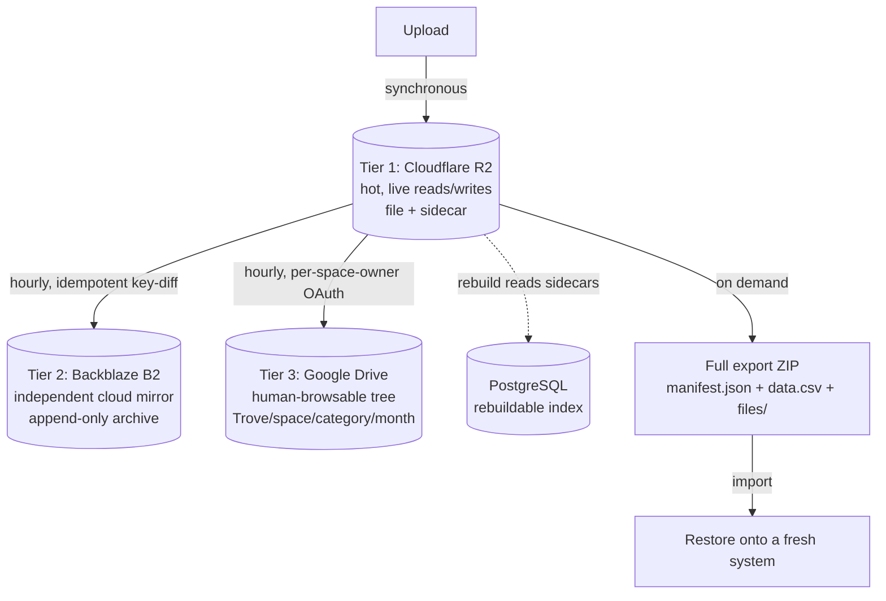
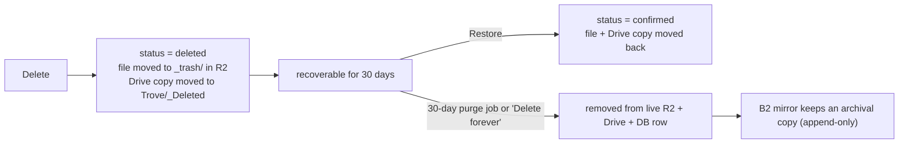

# Resilience and Backup

This is the document that explains the promise at the centre of Trove: **losing the entire
app, database and host must lose zero documents.** It covers the three independent copies,
the self-describing sidecars, the soft-delete and purge lifecycle, the on-demand export and
import, disaster recovery, and the integrity checks that prove the copies agree. Underlying
concepts (object storage, sidecars, rebuildable index, idempotency, eventual consistency) are
defined in [00-concepts.md](00-concepts.md). Originating decisions: D15 (export, import,
rebuild, pg_dump), D17 (Drive via per-space-owner OAuth), D19 (mirror to Backblaze B2).

## 1. The durability model

A document is considered safe the instant it exists in the hot store (Cloudflare R2) with its
sidecar. Everything else is redundancy layered on top:



The three copies are independent on purpose: they are different providers with different
accounts and different failure modes. A provider outage, an account suspension, or a bug that
corrupts one copy does not take the others with it. Tier 3 is specifically human-navigable so
that, in the worst case where the app and database are both gone, a person can open Google
Drive and find the document with no software involved.

## 2. Sidecars make the object store self-describing

Every file is written with a JSON sidecar beside it holding its complete record (category,
merchant, date, amount, due date, raw text, owner, and more). This is what makes the database
rebuildable: the facts live with the file, not only in a table. The sidecar is rewritten
whenever the document changes (after extraction, after confirm, after edits), so it always
reflects the current truth. See the sidecar pattern in the concepts primer.

## 3. Tier 1: Cloudflare R2 (hot)

R2 is the live store, written synchronously on upload through the `StorageService` seam
(concept: S3-compatible API). Files are laid out by category and month, for example
`electricity/2026-01/reliance-jan.jpg` with its `...jan.json` sidecar. R2 was chosen for a
generous free tier and zero egress fees; the same code runs against MinIO locally.

## 4. Tier 2: Backblaze B2 mirror

An hourly job mirrors R2 into Backblaze B2, a different provider (decision D19). It is a
**key-diff copy**: it lists the keys present in R2 and the keys present in B2 and copies only
the difference, so it is idempotent and cheap, and a failed run simply completes next time. The
mirror is treated as an **append-only archive**: it accumulates copies and does not delete, so
even a document purged from the live store still has an archival copy in B2 by design. This is
the "an accidental or malicious delete cannot erase everything" guarantee.

## 5. Tier 3: Google Drive (human-browsable)

Drive is the copy a human can navigate without Trove (decision D17). A scheduled job organises
confirmed documents into a readable tree:

```
Trove / {space name} / {category} / {YYYY-MM} / file
```

Key design points:

- **Per-space-owner OAuth, not a service account.** A Google service account has no free Drive
  storage of its own, so Trove instead uses a space member's own Drive via OAuth, requesting
  only the `drive.file` scope (access limited to files Trove creates). The refresh token is
  encrypted at rest.
- **Pooling several Drives (decision D17).** A space can link more than one Drive, pooling
  everyone's free 15 GB. Two modes: **rotate** fills the active Drive and rolls to the next when
  it is nearly full (more total room), and **mirror** copies every document into all linked
  Drives (a second independent backup of everything). Each connection tracks its own quota via
  Google's `about.get`, and the folder tree and per-document sync state are keyed per connection
  because each Drive has its own tree.
- **Idempotent sync.** The `document_sync` table records, per connection, that a document has a
  copy with a given external id, so the job never re-uploads what is already there.

## 6. The delete lifecycle across tiers

Deleting is never an immediate erase. It is a soft delete with a 30-day recovery window
(decision-consistent with the durability promise):



- **Soft delete:** the row is tombstoned (`status = deleted`, `deleted_at`, `deleted_by`), the
  R2 object is moved to a `_trash/` prefix (`trash_key`), and the Drive copy moves to a
  `Trove/_Deleted` folder. The document drops out of every query (lists, spend, search, dedupe).
- **Restore:** exactly reverses it. Status back to confirmed, `trash_key` cleared, objects moved
  back to their category path.
- **Purge:** the daily 30-day purge job (or an explicit "Delete forever") removes the object from
  the live R2 store, deletes the Drive copy, and removes the database row and its dependents. The
  B2 mirror, being append-only, retains an archival copy, so "cleared everywhere" means the live
  R2 plus Drive plus database, never the archive.

## 7. On-demand full export and import

The export produces a single ZIP (streamed and zipped server-side) with three parts (see
`ExportService`):

- `manifest.json`: the complete record set, machine and LLM readable, for a lossless re-import.
- `data.csv`: a flattened, spreadsheet-friendly view for a human.
- `files/`: the original files and their sidecars, laid out to mirror the object store
  (`files/<storageKey>`, `files/<sidecarKey>`).

Importing that ZIP restores the system, including onto a fresh, empty deployment. This is the
ultimate "no provider outage can wipe me" guarantee: the user holds a complete, portable,
self-contained copy of their vault that does not depend on Trove existing at all.

## 8. Database backup (pg_dump)

Although the database is rebuildable from sidecars, a nightly `pg_dump` is also taken as a fast
restore path (decision D15). Restoring the index from a dump is quicker than re-scanning the
whole bucket, so the dump is an optimisation, not a source of truth. Backup and DR job outcomes
are logged to the `backup_run` table and surfaced in the admin backup view.

## 9. Disaster recovery: rebuilding the database

If the database is lost entirely, the rebuild job reconstructs it from the object store: it
scans the R2 bucket, reads each sidecar, and reinserts the corresponding index rows. Because no
authoritative fact lives only in the database, the rebuilt index is complete. The order of
preference for recovery is: restore the latest `pg_dump` (fastest), or rebuild from sidecars
(authoritative), or import a full export ZIP (works even onto a brand-new system).

## 10. Integrity verification

Redundancy is only worth something if you can prove the copies actually agree, so an integrity
check (`IntegrityService`, run daily and on demand) turns "we think we have three copies" into a
verified, drift-detecting health report (see `/api/integrity/report`):

- It lists R2 (and B2 if configured) into a set and checks, for each document, that the live
  object and its sidecar exist in R2, that a mirror copy exists in B2, and that a Drive copy
  exists (from the per-document sync records).
- Findings are ranked by danger. A missing live object or sidecar is the most serious; a missing
  mirror or Drive copy is a redundancy gap and a warning (and "not in Drive" is only a gap once
  the space actually has a Drive linked).
- The reverse check finds **orphans**: objects with no database row. Far from being errors, an
  orphaned sidecar is exactly what a rebuild would read back in, so orphans demonstrate that the
  database really is a rebuildable projection of the bucket.
- Trash (`_trash/`) is accounted for separately so deleted-but-not-purged files are not mistaken
  for gaps.

The report gives a live, ranked answer to the only question that matters for the durability
promise: is every document actually safe in more than one place right now.
