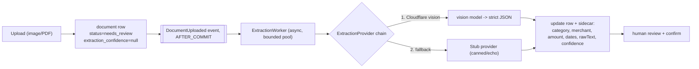
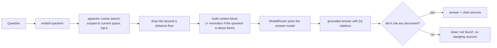
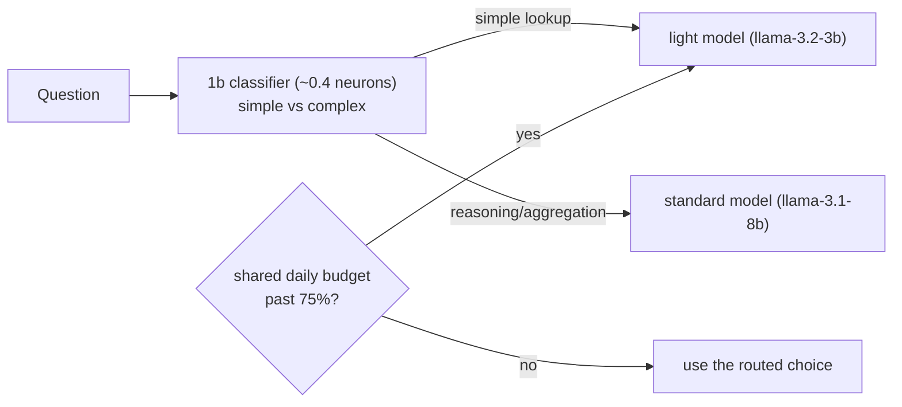

# AI, Extraction and Retrieval

Trove uses AI in four places: reading a document (extraction), embedding documents for
semantic search and question answering (indexing), answering questions grounded in the vault
("Ask your vault"), and parsing natural-language search. Every one of them is designed around
two constraints: the AI must never be trusted blindly, and everything must stay inside a free
daily budget. Concepts (embeddings, cosine distance, RAG, graceful degradation) are in
[00-concepts.md](00-concepts.md). Originating decisions: D9 (provider fallback chain), D13
(anomaly), D14 (search), D22 (Workers AI hardening).

## 1. The cost model and the budget guard

All AI runs on Cloudflare Workers AI, whose free allowance is measured in **neurons** (its
billed unit) and is a shared 10,000 neurons per day across the whole application. Cloudflare
returns tokens per request, not neurons, so Trove converts tokens to neurons using each model's
published input and output rates and records both.

`AiUsageTracker` records consumption per UTC day in the `ai_usage` table, keyed by user (a
shared synthetic id represents non-user or system usage), and enforces two limits: the shared
daily neuron limit, and a per-user cap so one person cannot exhaust the pool for everyone. When a
call would exceed the budget, the feature degrades rather than failing (see each feature below).
The Developer drawer shows a live gauge of global and personal spend in neurons and tokens.

This budget discipline is why pricing is researched before any AI feature is added, and why the
whole surface is designed to spend as little as possible per action.

## 2. Extraction: reading a document

Key design points:

- **Swappable provider interface (decision D9).** Extraction sits behind an
  `ExtractionProvider` interface: one call in, structured JSON out
  (`{category, merchant, docDate, amount, dueDate, lineItems, rawText, confidence}`). Providers
  are arranged as a fallback chain, real vision model first, then a stub that never fails. This
  is what lets an upload succeed even when the AI does not.
- **Asynchronous, after commit.** Extraction runs on a bounded background executor, triggered by
  an `AFTER_COMMIT` event so it only reads a document that actually committed (concept:
  transactional events). A reconciler catches any document whose extraction never completed after
  a crash.
- **Human review is mandatory.** Every extraction lands in `needs_review`. The AI will misread an
  amount or a date, so extracted numbers are never trusted silently; a person confirms the fields
  before a document is `confirmed`. Confirming is what makes a document count toward spend, become
  searchable, and generate reminders.
- **The pending sentinel (decision D5).** `extraction_confidence IS NULL` means "extraction has
  not finished", with no extra status column. The review screen polls until it is set.
- **Cost control.** Images larger than 1600px on the longest edge are downscaled and re-encoded as
  JPEG before being sent to the vision model, which both improves reliability and cuts neuron cost.
  Only images are sent to AI; PDFs and other stored files are kept but not auto-read. Extraction is
  skippable per upload (the user can turn AI reading off and fill in fields by hand).
- **Graceful degradation (decision D22).** If the vision model errors, returns an unusable shape,
  or the daily budget is spent, the chain falls back to the stub and the document is still stored
  for manual entry. An upload never fails because the AI failed.

## 3. Indexing: embeddings for search and chat

When a document is confirmed, it is embedded for semantic retrieval (concept: vector embeddings).
A compact description (category, merchant, date, amount, key fields, and OCR text, plus email
fields for emails) is embedded with Cloudflare's `bge-base-en-v1.5` model into a 768-dimension
vector, stored in the `document_embedding` table via pgvector. Embedding is triggered by the
confirm event and is idempotent (upsert keyed by document id); an hourly sweep catches anything
not yet embedded, and a re-index endpoint forces it on demand. Embedding cost is negligible per
document. The stored `model` column means a model change transparently re-embeds affected rows.

## 4. Ask your vault: retrieval-augmented answering

"Ask your vault" answers a natural-language question strictly from the user's own documents
(concept: RAG). The flow:

Grounding and honesty:

- Retrieval is always scoped to the caller's current space, so one user's question never reaches
  another's documents.
- The model is instructed to answer only from the retrieved context and to cite each fact by
  document number. If it cites nothing, that is treated as "nothing relevant", and the answer is
  returned with no sources rather than dangling unrelated documents under a refusal. A cosine
  distance floor is a secondary backstop against clearly-unrelated matches.
- Reminders are a separate kind of vault data and are not embedded, so when a question is about
  reminders, renewals, due dates or warranties, the space's reminders are folded into the context
  and their linked documents are pulled in as citations. This is why "tell me about my warranties"
  now answers instead of finding nothing.
- If the budget is spent or the assistant is disabled, it degrades to retrieval-only: it still
  returns the most relevant documents, just without a written summary.

## 5. Cost-aware model routing

Using the strongest chat model for every question would burn the free budget quickly, so a tiny
classifier routes each question (decision D22, and the reasoning the user asked for):

- A near-free 1b classifier labels the question simple (a single-fact lookup) or complex
  (reasoning, comparison, aggregation). Simple goes to a cheaper 3b model; complex goes to the
  stronger 8b model. On uncertainty it defaults up, to protect answer quality.
- When the **shared** daily budget crosses a configurable fraction (75% by default), everything is
  forced to the light model so the free tier stretches across more users. This downgrade is
  triggered by the global pool, not by an individual's usage.
- Both the classifier and the answer bill through the same budget guard, and the whole thing
  degrades to retrieval-only once the pool is exhausted.

## 6. Natural-language search

Search is AI-first with a rule-based fallback (decision D14, later moved AI-first at the user's
direction). A plain-English query ("toll receipts from June", "all Nike purchases", "my last
water bill") is parsed into a structured filter (category, merchant, date range, amount, and so
on) which then runs as an ordinary database query. When the daily budget is spent, it falls back
to a deterministic keyword-and-rule parser so search always works, just less flexibly. Search
covers confirmed documents and is space-scoped like everything else.

## 7. Anomaly detection

Anomaly detection flags a bill that is unusually high for its category, the "your electricity is
40% higher than usual" feature (decision D13). It is deliberately simple and needs no AI:

- At confirm time, `AnomalyService` compares the document's amount to the **trailing average** of
  prior confirmed documents in the same category over a lookback window (12 months by default).
- It requires a minimum number of prior samples (3 by default) so it never false-alarms on a first
  bill, and flags only when the amount exceeds the average by a threshold fraction (40% by
  default). It flags high, not low, matching the stated use case.
- The verdict (whether it is an anomaly, the trailing average, and the percentage over) is stored
  on the document's `extra.anomaly` at confirm, so clients can show "about 42% higher than usual
  (you normally pay around a certain amount)" without recomputing. The review screen, the
  documents list, and the Spend page all read that verdict.

Anomaly is intentionally arithmetic rather than a model call: it is cheap, explainable, and does
not spend the AI budget, which is the right trade for a recurring per-confirm check.

## 8. Why the AI surface stays free

Pulling the threads together: extraction downscales images and only reads images; indexing uses a
tiny embedding model and is idempotent; answering routes to the cheapest adequate model and drops
to the light model under budget pressure; search and anomaly fall back to rules and arithmetic.
Every path degrades rather than failing, and every call is metered against a shared daily budget
with per-user caps. This is how a genuinely useful AI feature set fits inside a free tier for a
100-user vault.
