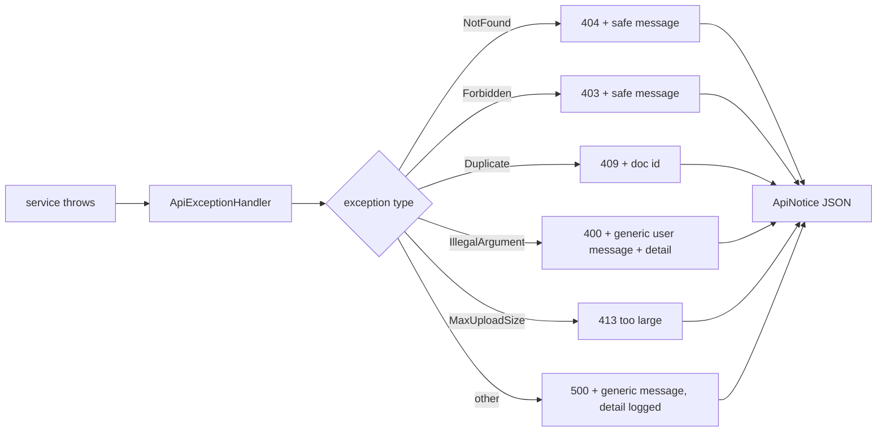

# LLD: The Notice System

Cross-cutting module: `common/notice` and the global exception handling in `common`. The Notice
System is Trove's uniform, two-channel feedback envelope across the API, the web client and the
mobile client. Originating decision: D23.

## 1. The problem it solves

Two failure modes plague app feedback: showing users a raw stack trace or opaque error, and
hiding from developers what actually went wrong behind a vague "something went wrong". The Notice
System refuses both. Every outcome carries a calm, human-readable message for the user and, in the
same envelope, a developer note with a stable code for diagnosis. Nothing is hidden and nothing is
leaked.

## 2. Key classes

| Class | Role |
| --- | --- |
| `ApiNotice` | The envelope: level, code, user message, developer note. |
| `NoticeLevel` | success, info, warning, error. |
| `ApiExceptionHandler` | Global `@ControllerAdvice` that converts any thrown exception into a Notice with the right HTTP status. |
| `SecurityNoticeHandler` | Renders auth failures (401 or 403) as Notices too, so security errors are not raw. |
| domain exceptions | `NotFoundException`, `ForbiddenException`, `UnauthorizedException`, `ConflictException`, `DuplicateDocumentException`, and validation errors, each mapped to a status and a safe user message. |

## 3. How errors become notices

The handler uses a `safe(...)` helper so internal messages are not leaked to the user by default:
the user sees a calm message (for example "That request wasn't quite right.") while the developer
detail and stable code travel in the same body for the drawer and logs. This is a deliberate
security choice; features that want a specific user-facing validation message surface it on the
client side instead (as the upload screen does when it skips unsupported files).

## 4. On the clients

Both clients render notices the same way, so the feedback language is consistent across web and
mobile:

- A **toast** shows the user message, colour-coded by level, self-dismissing, with the developer
  note one click away.
- A **developer drawer** retains recent notices and API calls (and, on web, the live AI-budget
  gauge), for diagnosis without a browser console.

Successful operations also emit notices (for example "Saved to your vault.", "Reminder added.",
"Snoozed 3 days."), so the same channel carries confirmation as well as failure. A single request
interceptor on each client feeds the drawer and raises toasts, so no feature has to wire feedback
by hand.

## 5. Why this is a first-class module

Feedback is a cross-cutting concern: it touches every endpoint and every screen. Centralising it
as one envelope with one handler and one client renderer means new features get correct,
consistent feedback for free, and a developer can always answer "what actually happened" from the
drawer without reproducing the issue against a console.
