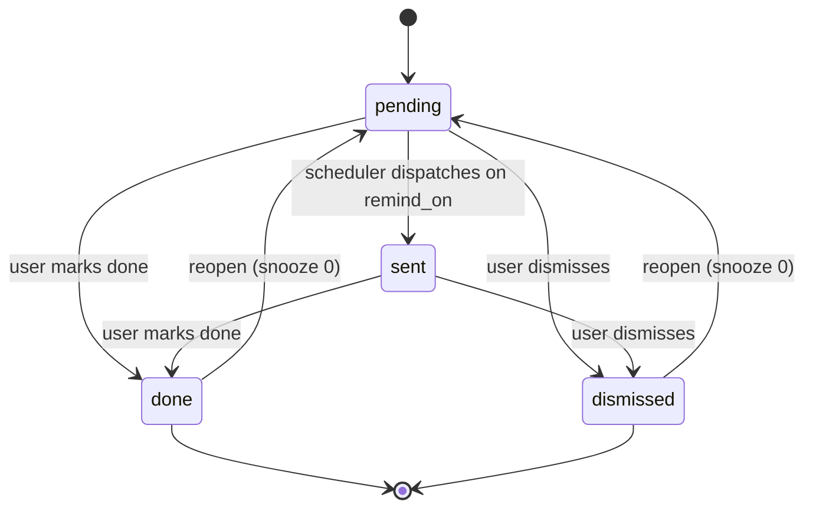

# LLD: Reminders and Notifications

Modules: `reminder`, `notification`. Reminders nudge a user before a bill is due, a policy
renews, or a warranty expires, and are created both by hand and automatically from confirmed
documents.

## 1. Key classes

| Class | Role |
| --- | --- |
| `ReminderController` | REST surface: list, create, edit (PATCH), snooze, done, dismiss. |
| `ReminderService` | All business logic: create, snooze, mark done (with recurrence rollover), edit, dismiss, dispatch due, and auto-create from a confirmed document. |
| `Reminder` | The entity: type, optional title, remind-on date, recurrence, status, completed-at. |
| `ReminderType` / `ReminderStatus` / `ReminderRecurrence` | String-constant value sets, plus the recurrence date arithmetic. |
| `ReminderRepository` | Queries: by space, by status, due-for-dispatch, and the per-document/date guards. |
| `ReminderScheduler` | Fixed-delay job that dispatches due reminders. |
| `ReminderNotifier` | Delivers a due reminder (emails the space via the `notification` module). |
| `ReminderEventListener` | Consumes `DocumentConfirmedEvent` to auto-create reminders. |

## 2. Lifecycle and states

Status flows `pending` to `sent` (dispatched by the scheduler) and then to `done` (handled) or
`dismissed` (never mind). "Due now" is any active reminder (pending or sent) dated on or before
today. The web tabs are Due now, Upcoming, Done and Dismissed; the actions are Done, Snooze
(1 day / 3 days / 1 week), Edit and Dismiss, with Reopen for done or dismissed rows.

## 3. Recurrence

`recurrence` is one of `none`, `weekly`, `monthly`, `quarterly`, `yearly`. A recurring reminder
schedules its next occurrence **when marked done**, not at dispatch, so a series advances exactly
once and never double-schedules. `ReminderRecurrence.next(recurrence, from, notBefore)` steps by
the interval until the date is strictly after today, so a series whose date slipped into the past
jumps straight to the next future date. Example: a monthly reminder for 2026-01-10 marked done on
2026-03-20 yields the next occurrence on 2026-04-10.

## 4. Auto-creation from a confirmed document

On `DocumentConfirmedEvent`, `ReminderService.createRemindersFromDocument` loads the document and
does three independent things (`REQUIRES_NEW` transaction, because it runs from an after-commit
listener):

1. **A dated reminder from the due or expiry date**, at each configured lead time (default 7, 1
   and 0 days before). Its type follows the category: an `insurance` or `subscription` date is a
   `renewal`, everything else is a payment `due`.
2. **A warranty reminder** when the document carries `extra.warrantyUntil` (set on the review
   screen with +1 year / +2 years shortcuts), at the warranty lead times (default 14 and 0 days
   before), titled with the merchant.
3. **Subscription detection**: if the same merchant has billed on a steady cadence
   (weekly/monthly/quarterly/yearly across three or more confirmed documents), it schedules a
   recurring `renewal` for the next expected date, titled "Merchant renewal". It fires once per
   merchant and only on a clean cadence (every gap must fall in the same band), never on irregular
   history. Subscription detection runs only when the document did not already yield a dated
   reminder, so a policy with an explicit date is not double-flagged.

All auto-creation is idempotent: each dated lead is guarded by a per-document/type/date existence
check, and the recurring reminder is guarded per merchant, so re-confirming never duplicates.

## 5. Dispatch

`ReminderScheduler` runs on a fixed delay (default hourly). `ReminderService.dispatchDue(today)`
finds pending reminders whose date has arrived, delivers each through `ReminderNotifier` (which
emails the space via the `notification` module and `BrevoEmailSender`), and marks them `sent`. A
delivery failure is logged but still marks the reminder sent so the sweep never wedges. On mobile,
the Flutter app additionally schedules on-device local notifications so alerts fire even when the
app is closed.

## 6. Data, endpoints, configuration

- Data: the `reminder` table (see [data model](../architecture/02-data-model.md)); a partial
  index on `remind_on where status='pending'` keeps the dispatch scan cheap.
- Endpoints: see [../api/reference.md](../api/reference.md) under Reminders.
- Configuration: `trove.reminder.scan-fixed-delay-ms`, `lead-days-list` (default 7,1,0), and
  `warranty-lead-days-list` (default 14,0).

## 7. Visibility

The Documents view shows a "reminders to act on" strip (active reminders due within 30 days or
overdue, soonest first, red when overdue) linking to the Reminders page, so due dates are not
buried on their own screen.
