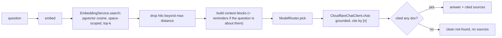

# LLD: Search and Ask-your-vault

Modules: `search`, `chat`. The conceptual framing (embeddings, cosine distance, RAG, model
routing) is in [../architecture/05-ai-and-extraction.md](../architecture/05-ai-and-extraction.md).

## 1. Search

Natural-language search turns a plain-English query into a structured filter that runs as an
ordinary database query.

| Class | Role |
| --- | --- |
| `SearchController` | `GET /api/search` (results) and `/api/search/structured` (the parsed filter, for debugging). |
| `SearchService` | Orchestrates parse then query. |
| `NaturalQueryParser` (interface) | Turns a query into a `SearchQuery`. |
| `LlmQueryParser` | AI-first parser (Cloudflare), the default. |
| a rule-based parser | Deterministic fallback when the AI budget is spent. |
| `DocumentSpecifications` | Builds the JPA Specification (category, merchant, date range, amount) from a `SearchQuery`. |

The query is parsed into fields (category, merchant, date range, amount comparison), which
`DocumentSpecifications` compiles into a type-safe query over confirmed, non-deleted documents in
the current space. When the budget is exhausted the rule-based parser keeps search working, just
less flexibly (D14, later moved AI-first at the user's direction).

## 2. Ask your vault (RAG)

Grounded question answering over the user's own documents, with citations.

| Class | Role |
| --- | --- |
| `ChatController` | `POST /api/chat/ask` and `POST /api/chat/reindex`. |
| `VaultChatService` | The RAG orchestration: retrieve, build context, route, answer, enforce honesty. |
| `EmbeddingProvider` (interface) / `CloudflareEmbeddingProvider` / `StubEmbeddingProvider` | Produce the 768-dim vector; Cloudflare when configured, else the offline stub. |
| `EmbeddingService` | Compose the document text, embed, upsert into pgvector, and run space-scoped similarity search. |
| `ModelRouter` | Classify the question and pick the answer model, with budget-aware downgrade. |
| `CloudflareChatClient` | The shared chat call. |
| `ChatIndexListener` / `ChatReindexJob` | Embed on `DocumentConfirmedEvent`; hourly sweep for anything unembedded. |
| `ChatProperties` | Models, top-k, snippet cap, max distance, routing and budget-downgrade knobs. |

### Retrieval and answering

Honesty mechanisms: retrieval is scoped to the current space; a cosine distance floor drops
clearly-unrelated hits; and if the grounded answer cites no document, the sources are suppressed
so a refusal never dangles unrelated documents. When a question is about reminders, renewals, due
dates or warranties, the space's reminders (which are not embedded) are folded into the context
and their linked documents added as citations.

### Model routing

A near-free 1b classifier labels each question simple or complex. Simple goes to a light 3b model,
complex to a stronger 8b model, defaulting up on uncertainty. When the shared daily budget crosses
75% (configurable) everything is forced to the light model. When the budget is fully spent the
feature degrades to retrieval-only (ranked sources, no written answer).

## 3. Data and configuration

- Data: `document_embedding` (pgvector `vector(768)`, one per document, space-scoped). An HNSW
  cosine index backs fast nearest-neighbour search.
- Configuration: `trove.chat.*` (embedding model, chat and router models, top-k, max-snippet,
  max-distance, budget-downgrade fraction) and `trove.search.*`. See
  [../operations/configuration.md](../operations/configuration.md).
