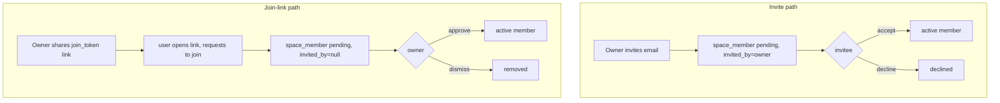

# LLD: Spaces, Auth and Access Control

Modules: `space`, `auth`, `common/security`. The conceptual model (roles, the JWT lifecycle,
encryption) is in [../architecture/03-security-and-access.md](../architecture/03-security-and-access.md);
this document is the implementation.

## 1. Key classes

| Class | Role |
| --- | --- |
| `AuthController` | Register, login, forgot-password, reset-password. |
| `AccountController` | TOTP setup, enable, disable, status (authenticated). |
| `AdminController` | Approve or reject pending sign-ups (admin only). |
| `JwtService` / `JwtProperties` | Issue and validate HMAC-SHA256 tokens; 12-hour default lifetime. |
| `TotpService` | RFC 6238 code generation and verification (plus/minus one step). |
| `PasswordResetService` | Single-use, hashed, expiring reset tokens; Brevo email. |
| `UserService` | Registration (approval gate), `isAdmin`, approve/reject, pending list. |
| `SpaceService` | Create spaces, membership, invitations, join links, roles. |
| `SpaceAuthorization` | `requireCanRead` / `requireCanWrite` guards used by every space-scoped service. |
| `SecurityConfig` | The filter chain and the public-route allow-list. |
| `CurrentUser` | Exposes the authenticated caller id to services. |
| `EncryptionService` | AES-256-GCM for vital documents and stored secrets. |

## 2. Data

`app_user` (identity, status, TOTP columns), `space` (kind, description, drive_sync_mode,
join_token), `space_member` (role, status, invited_by), `password_reset_token`, and
`ingest_token`. See the [data model](../architecture/02-data-model.md).

## 3. Authorization in practice

Every space-scoped service call begins with `SpaceAuthorization.requireCanRead(spaceId, userId)`
or `requireCanWrite(...)`. Read allows any active member (viewer, member, owner); write allows
active member or owner. Owner-only actions (member management, Drive configuration, space
deletion, ingest rotation) check the role explicitly. A failed check raises `ForbiddenException`,
which the global handler renders as a 403 Notice. Because a document belongs to exactly one space,
access is entirely a function of space membership.

## 4. Membership and joining

The join link never auto-adds anyone: it only creates a pending self-request the owner approves.
The token can be rotated (invalidating the old link) or revoked. `invited_by = null`
distinguishes a self-request from an invitation in the members list.

## 5. Space context on the clients

The web client holds the loaded spaces and the current space id in a `SpaceContext`, and screens
read the current id and reload when it changes. Until spaces load, the id is undefined and API
calls omit `spaceId`, so the backend falls back to the personal space. The context load retries
with backoff and is re-entrancy guarded, so a slow or briefly failed first load cannot leave the
switcher empty (a bug fixed after observation). The mobile app carries the same notion.

## 6. Configuration

`trove.security.jwt.secret` and `expiration-minutes`; `trove.admin.email` (who the admin is);
Brevo email settings for reset; the encryption key. See
[../operations/configuration.md](../operations/configuration.md).
